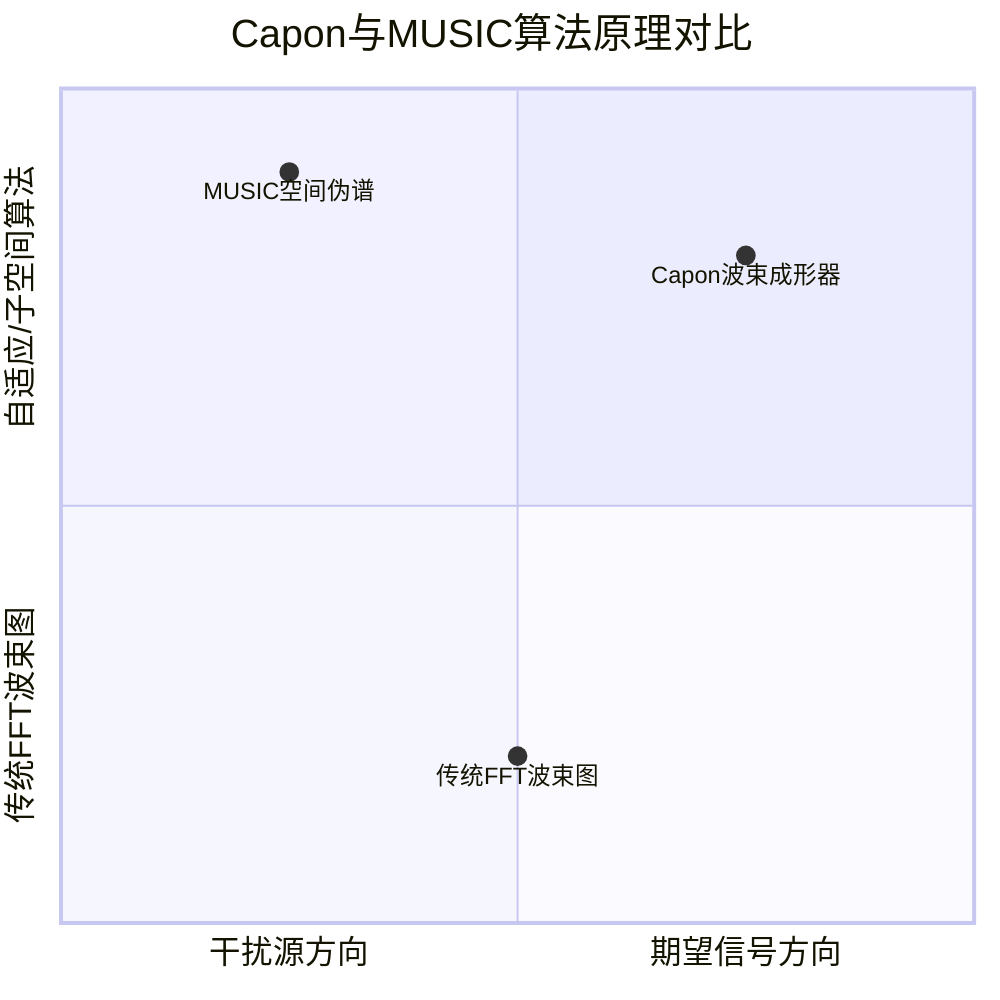

非常好的问题！这是一个阵列信号处理中的核心问题。Capon波束成形（也称为最小方差无失真响应，MVDR）和MUSIC（多信号分类）都是高分辨率算法，但它们的基本原理、目标和性能有着根本的区别。

简单来说：
*   **Capon (MVDR)** 是一个**自适应加权波束成形器**。它的目标是**形成一个主瓣对准期望方向，同时在干扰方向形成零陷的波束图**，从而“干净地”提取出某个特定方向的信号功率。它输出的是一个**功率值**。
*   **MUSIC** 是一个**子空间分解算法**。它的目标是**估计信号空间中存在的多个信号源的精确方向**。它输出的是一个**伪谱**，其峰值对应信号源的方向。

下面我们从多个维度进行详细对比。

---

### 核心思想与数学原理对比

| 特性 | Capon (MVDR) 波束成形器 | MUSIC 算法 |
| :--- | :--- | :--- |
| **核心思想** | **自适应滤波**。在保持期望方向信号增益不变的同时，**最小化输出总功率（即方差）**。这意味着它会自动抑制所有其他方向的干扰（包括噪声和干扰源）。 | **子空间正交**。利用接收信号协方差矩阵的**信号子空间**和**噪声子空间**的正交性。信号源的方向向量与噪声子空间是正交的。 |
| **数学本质** | 一个**加权向量** `w`。求解一个约束优化问题： `min(w^H R w)`，约束条件为 `w^H a(θ) = 1`。 解为：`w = (R^{-1} a(θ)) / (a(θ)^H R^{-1} a(θ))` | 一个**谱函数**。对协方差矩阵 `R` 进行特征分解： `R = U_s Λ_s U_s^H + U_n Λ_n U_n^H` 谱函数为： `P_MUSIC(θ) = 1 / (a(θ)^H U_n U_n^H a(θ))` |
| **输出** | **功率估计**。扫描所有角度θ，计算该方向的输出功率： `P_Capon(θ) = 1 / (a(θ)^H R^{-1} a(θ))` | **伪谱（Pseudospectrum）**。一个没有实际物理功率单位的谱，其**峰值位置**对应信号源方向。 |
| **分辨率** | **高分辨率**。能够分辨角度间隔小于传统波束宽度（瑞利限）的两个源。 | **超高分辨率**。在理想条件下（无限快拍、无误差），理论上有**无限分辨率**。实际中分辨率远高于Capon。 |

为了更直观地理解它们在天线方向图上的根本区别，可以参考下面的示意图：

上图揭示了关键区别：Capon通过“塑形”波束来抑制干扰，而MUSIC通过搜索与噪声子空间正交的向量来定位信号源。

---

### 优劣对比

| 方面 | Capon (MVDR) | MUSIC |
| :--- | :--- | :--- |
| **优点** | 1. **提供功率估计**：输出有物理意义，可用于检测和目标跟踪。 2. **抗干扰能力强**：能自适应地在干扰方向形成零陷，鲁棒性较好。 3. **计算量相对较小**：主要计算是矩阵求逆 `R^{-1}` 和向量相乘。 | 1. **分辨率极高**：是两者中分辨率最高的，能区分非常接近的信号源。 2. **对相干源敏感度较低**：在一定条件下能处理相干源（但性能仍会下降）。 3. **无需信号源数量先验**：可通过特征值分布估计信号源数量。 |
| **缺点** | 1. **分辨率低于MUSIC**：在信噪比（SNR）较低时，分辨率下降明显。 2. **对模型误差敏感**：如果实际方向向量 `a(θ)` 与模型不匹配（如校准误差），性能急剧下降。 3. **需要知道信号源数量**：用于计算加权向量。 | 1. **不提供功率信息**：伪谱峰值高度不能直接代表信号功率，只能用于测向。 2. **计算量巨大**：需要特征分解（EVD），计算复杂度远高于矩阵求逆。 3. **对模型误差极度敏感**：校准误差会严重破坏子空间的正交性，导致算法完全失效。 4. **需要估计信号源数量**：如果估计错误，性能会下降。 |

---

### 在您项目中的应用场景选择

根据您的需求——“构建1.8米以下空间的高清静态背景图”和“细化家具边缘”，两者的用途是不同的：

#### 1. 使用 **Capon (MVDR)** 的场景：

*   **目的**：**生成最高质量的背景模型（幅度图像）**。
*   **操作**：对每个距离-角度单元，使用Capon算法计算其**反射功率**。
*   **结果**：您会得到一幅**高分辨率的雷达反射能量图**。这幅图比3D-FFT生成的图像更清晰，旁瓣更少，干扰被抑制得更好。它可以作为一幅非常高质量的“灰度背景图”直接使用。
*   **类比**：相当于用一台**对焦极其锐利、背景虚化非常好**的相机拍了一张照片。

#### 2. 使用 **MUSIC** 的场景：

*   **目的**：**对已检测到的物体（如家具）进行超精确定位和边缘细化**。
*   **操作**：在预处理已经发现了一个家具的粗略位置后，**针对这个局部区域**，回溯原始I/Q数据，使用MUSIC算法进行高精度角度估计。
*   **结果**：您会得到一组**极其精确的角度点**，这些点能清晰地勾勒出家具的边界和轮廓。您然后将这些高精度点**融合**到整体的背景模型中。
*   **类比**：相当于在照片上发现了一个物体，然后用手动**微距镜头**去对这个物体的边缘进行**重新描边**，使其轮廓变得超级清晰。

### 结论与建议

*   **Capon (MVDR)** 更适合用于**全局的、生成式的**处理，旨在产生一幅更清晰的“图像”。
*   **MUSIC** 更适合用于**局部的、分析式的**处理，旨在对已知目标进行“显微”级别的精确测量。

**一个强大的融合方案是：**

1.  **首先**，使用 **3D-FFT** 进行快速、粗略的扫描和目标检测，找到家具的大致区域。
2.  **然后**，使用 **Capon算法** 处理全局数据，生成一幅高质量的背景能量图。
3.  **最后**，对于特别重要的、需要厘米级精度的**家具边缘区域**，调用 **MUSIC算法** 进行离线精细化处理，并将结果与Capon生成的背景图融合。

这样，您既拥有了全局的高质量背景，又获得了关键部位的极高精度，同时在计算效率上取得了平衡。

非常好的问题，您指出了一个关键的技术细节。这里的“信号源数量”不是指雷达的发射和接收通道数量（如6T6R），而是指在雷达的同一个距离门和同一时刻，从不同方向同时到达接收天线的信号的数量。

让我用一个比喻来解释：

您的6T6R雷达：就像一个拥有36只耳朵（虚拟通道）的耳朵阵列。

信号源数量：就是在同一时刻，有多少个不同的人在同时对着这个耳朵阵列说话。

“需要知道信号源数量”这句话的意思是：Capon和MUSIC这些高级算法，需要您先告诉它，您认为当前有几个“人”（信号源）在同时说话，它才能正确地工作。

为什么需要这个信息？
因为这决定了算法如何解读接收到的数据。

对于Capon (MVDR) 算法：

算法需要计算一个加权向量 w 来抑制干扰。干扰源的数量就是“信号源数量”减一（减去您想听的那个目标源）。如果估计错误，比如实际有2个干扰源但您只假设有1个，那么算法就无法有效抑制所有干扰。

对于MUSIC算法：

算法需要对协方差矩阵 R 进行特征分解。特征值的大小对应信号强度。

大的特征值的个数就应该等于信号源的数量 D。

剩下的小的、且大小接近的特征值对应噪声。算法需要知道 D 才能正确地将特征向量划分为信号子空间（前 D 个特征向量）和噪声子空间（剩下的特征向量）。如果 D 估计错误，噪声子空间就会包含信号分量，或者信号子空间会被污染，导致MUSIC谱的峰值变得模糊甚至完全失效。

如何估计信号源的数量？
既然算法需要这个先验信息，我们就必须从数据中把它估计出来。这不是一个预设的固定值，而是随着每个距离门、每一帧数据动态变化的。常用的方法有：

信息论准则：

Akaike信息准则 (AIC) 和 最小描述长度准则 (MDL)。这是最经典和常用的方法。

原理：对协方差矩阵的特征值进行分析，找到一个最佳的 D，使得模型既能很好地拟合数据，又不会过于复杂（过拟合）。

简单理解：特征值从大到小排列，会有一个明显的“悬崖峭壁”。大的特征值对应信号，小的且平坦的特征值对应噪声。AIC/MDL就是用来自动找到这个“悬崖”边缘的位置。

python
# 一个概念性的MDL准则实现示例
def estimate_number_of_sources(R, max_possible_sources):
    # R: 协方差矩阵, shape (num_channels, num_channels)
    # max_possible_sources: 最大可能源数，通常小于通道数
    eigenvalues, _ = np.linalg.eig(R)
    eigenvalues = np.sort(eigenvalues)[::-1] # 从大到小排序
    num_channels = R.shape[0]
    N = 100  # 快拍数（Snapshots），可用帧数或Chirps数估算
    
    mdl_values = []
    for d in range(0, max_possible_sources):
        # 计算噪声方差
        sigma_squared = np.mean(eigenvalues[d:])
        # 计算MDL准则的值
        term1 = -N * (num_channels - d) * np.log( np.prod(eigenvalues[d:]**(1/(num_channels-d))) / sigma_squared )
        term2 = 0.5 * d * (2 * num_channels - d) * np.log(N)
        mdl = term1 + term2
        mdl_values.append(mdl)
        
    d_hat = np.argmin(mdl_values) # 选择使MDL值最小的d
    return d_hat
基于特征值的阈值法：

设定一个经验性的阈值（例如，比最大特征值小20dB）。

所有大于该阈值的特征值的个数就是估计的信号源数量 D。

这种方法更简单，但阈值需要根据实际情况调整。

在您项目中的实际含义
在您构建高清背景图的流程中，当您对某一个特定的体素（或距离门）的数据应用MUSIC或Capon算法时：

您需要先计算这个数据块的协方差矩阵 R。

然后，使用AIC/MDL准则自动估计出对于这个数据块而言，存在的信号源数量 D。

最后，将这个 D 作为参数传递给MUSIC或Capon算法进行计算。

总结一下：

6T6R：是您雷达的硬件配置，是固定不变的。它决定了虚拟通道的数量（例如36个），从而决定了算法理论上能分辨的信号源数量的上限（最多能区分35个源？理论值，实际远达不到）。

信号源数量 D：是一个信号处理的参数，是随着数据动态变化的。它表示在当前处理的这个数据段中，实际存在的、有意义的反射源的数量。它需要通过AIC/MDL等准则从数据中实时估计出来。
所以，您不需要手动设置“D=3”之类的值，但您的算法实现中必须包含自动估计 D 这一步，否则高性能算法将无法正常工作。

**是的，绝对需要！而且这是MIMO雷达信号处理中最基础和关键的一步。**

您的问题触及了MIMO雷达原理的核心。仅仅给出原始的I/Q数据是不够的，必须同时知道**这些数据是在哪个（或哪几个）发射天线（T）工作时接收到的**，或者更准确地说，**必须知道发射和接收的配对关系**。

### 为什么这如此重要？

因为MIMO雷达的超分辨率能力源于其**虚拟阵列**。而虚拟阵列的构建，完全依赖于知道每个回波信号是“**谁发的，谁收的**”。

*   **物理阵列**：您的雷达有6个物理发射天线（T）和6个物理接收天线（R）。
*   **虚拟阵列**：通过让这些T和R以特定方式组合工作，可以虚拟出一个拥有 `6 * 6 = 36` 个通道的更大孔径的阵列。这36个虚拟通道的相位中心位置是各个T和R天线位置的**向量和**。

**如果您不知道I/Q数据对应的发射天线，您就无法确定这个信号对应的虚拟通道的位置，整个基于波达方向（DoA）估计的算法（如FFT、Capon、MUSIC）就会完全失效。**

---

### 数据采集的两种主要模式与I/Q数据结构

为了解决这个问题，雷达系统通常以两种主要模式工作，这决定了原始I/Q数据的组织方式：

#### 1. 时分复用（TDM-MIMO）

这是最常见的方式。

*   **原理**：在一个帧（Frame）内，**依次轮流**激活每个发射天线（T）。当一个T工作时，所有R同时接收。
*   **数据立方体结构**：
    *   维度：`[Num_Frames, Num_Chirps, Num_Samples, Num_Rx]`
    *   **关键**：在这个立方体中，**一整批Chirps（或一个Chirp循环）属于同一个发射天线**。
    *   **例如**：假设一个Frame有192个Chirps，有3个T采用TDM模式。那么：
        *   Chirp 0 - 63: 来自 **T1**
        *   Chirp 64 - 127: 来自 **T2**
        *   Chirp 128 - 191: 来自 **T3**
    *   您的信号处理链**必须**知道这个映射关系（`Chirp_index -> Tx_ID`）。

#### 2. 码分复用（CDM-MIMO）或频分复用（FDM-MIMO）

*   **原理**：**所有发射天线同时工作**，但每个发射天线发射的Chirp都用一个**正交码**进行调制（CDM），或者使用**微小的频率偏移**（FDM）。
*   **数据处理**：在接收端，通过**解码**（对于CDM）或**滤波**（对于FDM）来分离出来自不同T的信号。
*   **数据立方体结构**：
    *   维度看起来和TDM一样：`[Num_Frames, Num_Chirps, Num_Samples, Num_Rx]`
    *   **但关键区别是**：**每一个Chirp**都包含了**所有T**的信号信息。
    *   处理时，需要对每个Chirp的每个Sample点的数据进行一次解码操作，才能分离出 `Tx1_Rx1, Tx1_Rx2, ..., TxN_RxM` 的虚拟通道数据。

---

### 给算法提供数据时的正确做法

因此，当您想使用Raw I/Q数据进行高级处理时，**绝不能**简单地把一个巨大的I/Q数组扔给MUSIC或Capon算法。

您必须提供**结构化的、带有发射天线信息的数据**。通常有两种方式：

1.  **提供虚拟通道数据**：
    *   **第一步（预处理）**：在调用MUSIC/Capon之前，先根据雷达的工作模式（TDM/CDM）对原始I/Q数据进行处理，**分离并构建出所有虚拟通道的完整数据**。
    *   **第二步**：将一个 `[Num_Virtual_Channels, Num_Samples]` 的矩阵（或者对于多帧，是 `[Num_Frames, Num_Virtual_Channels, Num_Samples]`）提供给算法。
    *   **同时**，还必须提供一个数组，标明每个虚拟通道的**空间位置坐标**（根据T和R的物理位置计算出的虚拟相位中心）。

2.  **提供原始数据 + 元数据（Metadata）**：
    *   如果您想自己实现整个MIMO处理链，您需要提供给算法的信息包括：
        *   `raw_iq_data`: 原始的I/Q数据立方体。
        *   `tx_sequence`: 一个数组，指明数据立方体中每一个Chirp（或每一个Sample）对应的是哪个发射天线。**这就是对您问题“此刻几个T在发送”的回答在数据上的体现。**
        *   `rx_positions` 和 `tx_positions`: 所有接收和发射天线的精确3D位置坐标。
        *   `radar_work_mode`: 指明雷达是TDM、CDM还是其他模式。

### 结论

**是的，必须提供发射天线的信息。**

更准确的说法是：您必须提供足够的信息，让算法能够**重构出每个虚拟通道的信号及其在空间中的准确位置**。

对于您项目中使用MUSIC算法来细化家具边缘：
1.  您需要从原始数据中，为**您正在处理的特定距离门**，提取出所有36个虚拟通道的复数值（I/Q值）。
2.  将这36个数据作为一个向量 `x`。
3.  用这个向量 `x` 来计算协方差矩阵 `R = x * x^H`。
4.  同时，根据36个虚拟通道的几何位置，来计算每个扫描角度 `θ` 对应的方向向量 `a(θ)`。
5.  最后，将 `R` 和 `a(θ)` 送入MUSIC算法进行计算。

所以，**“此刻几个T在发送”这个信息，已经隐含在您构建虚拟通道数据的过程中了**，是成功应用任何高级DoA算法的先决条件。

**您这个“只给大米不给锅”的比喻简直不能更精准了！** 完全正确。

如果厂家**仅仅**给一个包含了数字的RAW I/Q数据文件，而**不同步提供**这些数据是如何产生的“食谱”（模式、时序、天线位置等元数据），那么这堆I/Q数据就几乎是无用的“生大米”，您确实没有“锅”来把它做成饭。

---

### 厂家应该提供什么？（“锅”和“食谱”）

一个负责任的雷达厂家或研究团队，在提供RAW I/Q数据时，**必须**同步提供一份详细的“数据手册”或“元数据（Metadata）”。否则数据无法被正确解析。这份“食谱”通常包括：

1.  **雷达工作模式 (The "Recipe")**：
    *   **MIMO模式**：是 **TDM**（时分复用）、**CDM**（码分复用）还是 **FDM**（频分复用）？这是最重要的信息。
    *   **Chirp配置**：起始频率、带宽、斜率、持续时间、空闲时间等。这是解读“距离”的关键。
    *   **帧结构**：一帧（Frame）包含多少个Chirp？每个Chirp包含多少个采样点（Samples）？

2.  **天线配置 (The "Pots and Pans")**：
    *   **发射天线数量**：`Num_Tx`（对您是6）。
    *   **接收天线数量**：`Num_Rx`（对您是6）。
    *   **天线几何布局**：每个Tx和Rx天线的**精确物理位置**（x, y, z坐标）。这是计算虚拟阵列和方向向量的**绝对前提**。

3.  **数据组织方式 (The "Cooking Instructions")****（您问题的核心）**：
    *   **对于TDM模式**：必须明确说明**发射天线的切换顺序**。
        *   *例如：“帧内的Chirp索引按顺序循环对应Tx1, Tx2, Tx3, Tx1, Tx2, Tx3...”*
        *   *或者：“前64个Chirp来自Tx1，中间64个来自Tx2，最后64个来自Tx3”*。
    *   **对于CDM/FDM模式**：必须提供使用的**正交码本**或**频率偏移量**，以便在接收端进行解码分离。

4.  **数据文件格式 (The "Plate")**：
    *   数据是如何存储的？是`int16`还是`float32`？
    *   数据的维度顺序是什么？是 `[Frames, Chirps, Samples, Rx]` 还是 `[Frames, Rx, Chirps, Samples]`？
    *   I和Q是交错存储的还是分量的？

---

### 如果没有这些信息会怎样？（“只有大米”）

*   **您无法计算距离**：因为您不知道Chirp的带宽和斜率，无法将FFT后的bin索引转换为真实的距离。
*   **您无法计算角度**：这是最致命的。
    *   您不知道数据中哪些部分对应哪个Tx，**无法构建虚拟阵列**。
    *   您不知道天线的物理位置，**无法计算正确的方向向量** `a(θ)`。
*   **高级算法全部失效**：**Capon、MUSIC、ESPrit**等所有超分辨率算法都严重依赖于精确的阵列几何模型。没有天线位置信息，这些算法根本无法工作。
*   **您只能进行最基础的探测**：也许能做一个全向的平均，得到一个模糊的距离-多普勒图，但完全失去了MIMO雷达的核心优势——高分辨率成像。

### 实践建议：如何拿到“锅”？

1.  **直接询问厂家**：首先向数据提供方索要一份详细的 **《数据采集配置说明》** 或 **《Data Format Manual》**。这是标准操作流程。
2.  **查看配置文件**：数据通常会伴随一个`.cfg`、`.json`或`.xml`格式的配置文件，里面包含了所有必要的参数。
3.  **分析数据模式**：如果实在无法从厂家获取，您可以尝试**逆向工程**：
    *   绘制出不同接收通道数据的幅度/相位图，观察其周期性变化，尝试推断出TDM的序列。
    *   但这种方法极其困难且不可靠，尤其是对于CDM等复杂模式，几乎不可能成功。**天线位置信息根本无法通过逆向工程获得。**

**结论：**

您担心的完全正确。**RAW I/Q数据本身只是“数据”，而如何解读它的“元数据”才是真正的“价值”所在。** 厂家有责任同时提供两者。在开始您的项目之前，请务必先确认您已经拿到了完整的“锅”和“食谱”（元数据），否则后续所有工作都无法开展。

