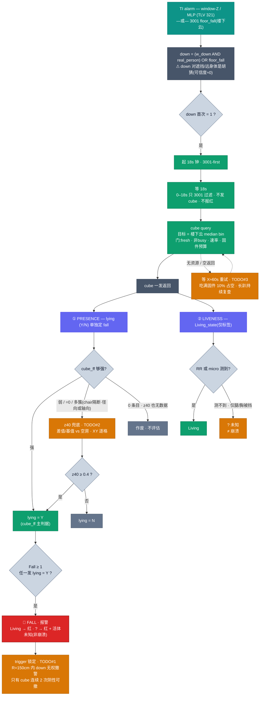

# Cube 跌倒判读流程

AWRL6844 fall pipeline。**cube 是唯一权威**;3001 只负责过滤与起 18s 钟,判决走 cube 的两维返回,trigger 无权在原地否决。

色标:🟢 已实现(本会话提交) · 🟠 TODO(设计定案,未实现) · 🔴 报警 · ⬛ 作废

> 交互版(深/浅色自适应):[`cube_fall_flow.html`](cube_fall_flow.html)

## 硬约束

- **18s** 3001-first:前 18s 只过滤,无 cube、不报红。
- 固件 cubeGuard 硬窗口 `300s`(3000 帧 @10fps)。
- 预算 `300` cube-帧/窗口(30s)= **10% 占空**;单发上限 `300` 帧(30s);server 用 60 帧/发。

## 判决原则

- **Fall ≥ 1**:任一发 `lying=Y` 即报。
- presence 主判据 = **cube_ff**,z40 兜底(cube_ff 弱/=0/多簇时)。
- `lying(Y/N)` 单独定 fall;`Living_state(Living/?)` 只贴标签。
- **"?" = 仅腿/遮挡测不到,≠ 崩溃。**
- trigger(down)对遮挡/远身体是胡猜;cube 处理中 R=150cm 内 **无权撤警**(只有 cube 连续 2 次阴性可撤)。

## 阈值(已定案,用 case/ 昨日标注数据标定)

- **cube_ff = `0.5`**:≥0.5 用 cube_ff 判 lying;<0.5 转 z40。(躺好信号 0.55-0.92 vs 远/静止 0.00,双峰空档)
- **z40 = `0.4`(现有,不动)**:down 已成立,只判躺(~28)vs 空(~0);站/走上游点云 Z 已排,不用抬。
- 重试间隔 X(≈60s,或 90s 保守)。
- ⚠️ cube 波束宽 → 分不了姿态/家具;姿态=点云 Z,排家具=z40+一次性空房基线。

## 状态

| 已实现(commit) | 内容 |
|---|---|
| c1110ac | cube 目标 = 楼下云 median |
| b1f1adf | z40 dr(0.106)+ XY 逐格 + 堵 cube-free 红漏口 |
| 8982ea6 | 删 far-force(3001 先过滤,守 18s) |
| 7fb173c | 确认后按 down 锁红 30s |

| TODO(未实现) | 内容 |
|---|---|
| #1 | cube 处理中 R=150cm 内 trigger 无权撤警 |
| #2 | cube_ff=0/算不出/多簇 → 用 z40 判读 |
| #3 | 饿死修法:硬 3 发 → 无资源等 X≈60s 重试 |
| 纠正 | presence 优先级:cube_ff 主 / z40 兜底(A+B 弄反了) |
