# Cube 跌倒判读流程

AWRL6844 fall pipeline。**cube 是最终确认权威**。完整 episode 是
`trigger_cancel 6s → 3001_filter 18s → cube(A-wide+B-narrow,1~3发/60s间隔) → red 后 LEG1/2 recovery`。
真倒后拿不到 track 是正常情况,不得因此取消 episode。

色标:🟢 已实现 · 🟠 TODO(设计定案,未实现) · 🔴 报警 · ⬛ 作废

> 交互版(深/浅色自适应):[`cube_fall_flow.html`](cube_fall_flow.html)

```mermaid
flowchart TD
    A["TI alarm — window-Z / MLP (TLV 321)<br/>—或— 3001 floor_fall(楼下云)"]:::src
    A --> B["锁定 Fall anchor=(x,y)<br/>FALL_ANCHOR_R=0.5m 定义本 episode 的空间身份"]:::proc
    B --> C{"① trigger_cancel window · 6s<br/>anchor R≤0.5m 内出现 upright + TI静默并持续1s?"}:::dec
    C -->|"是·明确反证"| XF["Trigger 误报 · 零成本取消<br/>不进 3001 · 不发 cube"]:::discard
    C -->|"否·默认通过"| D["② 开 episode · 3001_filter 18s<br/>track lost/无数据不取消;门外 track 与本 Fall 无关"]:::done
    D --> E{"anchor 内 3001 有明确 STAND/WALK veto?"}:::dec
    E -->|"是"| XF2["3001 明确过滤 · 轮结束"]:::discard
    E -->|"否·lying/SIT/空/track lost"| F["③ cube query #1<br/>A段 wide×短定位 peak → B段 narrow×长测量<br/>门:fresh · 非busy · 60s发送间隔 · 固件预算"]:::done
    F --> G["B narrow 一发返回<br/>RR/strength · cube_ff · z40"]:::proc

    G --> AB{"cube 校验<br/>(A) 位置:查询bin 与 当前楼下云bin ≤ 10 且存在(8e0cfdd)<br/>(B) 归属:回包必须属于【本次主动查询】· query-epoch 相等(0722d)<br/>发新查询即作废旧结果 · bin 距离判不了返回时间"}:::done
    AB -->|"任一失败"| VOID["作废 · 视为无返回"]:::discard
    VOID -.->|"60s 重查 · 不烧配额"| F

    AB -->|"通过"| P["① PRESENCE — lying (Y/N) 单独定 fall"]:::hd
    P --> PR{"B段 RR lock?<br/>rr有效 且 strength≥0.3"}:::dec
    PR -->|"是·呼吸活体就在该bin"| PY["lying = Y<br/>RR 自证 presence/location"]:::done
    PR -->|"否"| P1{"cube_ff 够强?"}:::dec
    P1 -->|"≥0.5"| PY
    P1 -->|"<0.5 / =0"| P2["z40 兜底<br/>差值/基值 vs 一次性空房基线 · XY逐格"]:::done
    P2 --> P3{"z40 ≥ 0.4 ?"}:::dec
    P3 -->|"是"| PY
    P3 -->|"否"| PN["lying = N"]:::discard
    P1 -->|"0 条目 · z40 也无数据"| PX["作废 · 不评估"]:::discard

    AB -->|"通过"| L["LIVENESS — Living_state(仅标签)"]:::hd
    L --> L1{"RR 或 micro 测到?"}:::dec
    L1 -->|"是"| LV["Living"]:::done
    L1 -->|"测不到 · 仅腿/胸被挡"| LU["? 未知 ≠ 崩溃"]:::todo

    %% ⭐ 红状态机:每发 cube 定'此刻' · 配额 ≤3 有效发/轮 · 作废不烧配额
    PY --> SM["🔴 Y = lying+isPerson<br/>升红/保持 · 阴性run 清零 · 扣 1 配额"]:::alarm
    PN --> NN{"N · 扣 1 配额<br/>连 2 发 N ?"}:::dec
    PX --> VD["作废(None)<br/>不扣配额 · 状态不动"]:::discard
    NN -->|"连 2N"| CLR["🟦 撤红 · 轮结束"]:::discard
    NN -->|"仅 1N(未达2)"| SM
    VD -.->|"60s 重查 · 不烧配额"| F
    SM --> QT{"配额尽(3 有效发)· 未 2N ?"}:::dec
    QT -->|"否 未满3"| F
    QT -->|"是"| HOLD["🔴 红保持 · 停查<br/>(报警是事件·已发出即完成)"]:::alarm

    %% ⭐ LEG1/2 只在 RED 后运行;不得介入 trigger_cancel / 3001_filter
    HOLD --> MU{"中途-up 撤红?(任一腿即撤)"}:::dec
    SM -.->|"红保持中随时可撤"| MU
    MU -->|"LEG1 cloud_up"| LG1["整云 median 世界高 &gt;0.4 · 持续2s · real_inst<br/>起身但未走开也可撤红"]:::done
    MU -->|"LEG2 walk-away"| LG2["① track先在 Fall spot≤0.8m 注册<br/>②相对起点位移≥1.5m<br/>③单步限速≤1.2m/s(步长&gt;0.3m才判瞬移)"]:::done
    LG1 --> STB["全清 + re-arm + 待机"]:::proc
    LG2 --> STB
    CLR --> STB
    STB --> RB["再倒 → 新 anchor · 新6s cancel · 新18s filter · 新≤3发"]:::proc
    RB -.-> A

    classDef src fill:#0d9488,color:#fff,stroke:#0b7d72,stroke-width:1px;
    classDef proc fill:#475569,color:#fff,stroke:#334155,stroke-width:1px;
    classDef dec fill:#cbd5e1,color:#0f172a,stroke:#64748b,stroke-width:1px;
    classDef done fill:#0e9f6e,color:#fff,stroke:#0b7a55,stroke-width:1px;
    classDef todo fill:#d97706,color:#fff,stroke:#a85d05,stroke-width:1px;
    classDef alarm fill:#dc2626,color:#fff,stroke:#991b1b,stroke-width:1.5px;
    classDef discard fill:#64748b,color:#fff,stroke:#475569,stroke-width:1px;
    classDef hd fill:#6366f1,color:#fff,stroke:#4f46e5,stroke-width:1px;
```

## Episode 时序与硬约束

- **Trigger-cancel 6s**:首次 trigger 锁定 Fall anchor。6s 是“等待明确反证”的窗口,不是要求 track 连续存在。只有 anchor `R≤0.5m` 内的 upright track + TI静默持续 `ARM_CANCEL_S=1s` 才取消。**真倒后 track lost/无数据默认通过**,门外 track(即使同 tid)与本 Fall 无关。
- **3001_filter 18s**:通过 6s 后起 episode,再运行 18s anchor-local 3001 过滤。明确 STAND/WALK 才 veto;lying/SIT/空/track lost 都不否决,继续 cube。
- **首次 cube ≈ Trigger+24s**:`6s + 18s` 后发 query #1。
- **Cube 1~3 发,60s 是发起间隔**:约在 Trigger `+24s/+84s/+144s`。每发不是采60s;每发内部为 A wide×约2s 定位 + B narrow×约6s 测量(含必要切换间隔)。
- 固件 cubeGuard 硬窗口 `300s`(3000 帧 @10fps)。
- 预算 `300` cube-帧/窗口(30s)= **10% 占空**;单发上限 `300` 帧(30s);server 用 60 帧/发。
- **LEG1/2 只允许在 red 后运行**,不得清空 trigger_cancel 或 3001_filter 阶段。

## 判决原则

- **Fall ≥ 1**:任一发 `lying=Y` 即报。
- B narrow presence 优先级:**RR lock**(`rr`有效且 `strength≥0.3`,呼吸活体自证 presence/location) → **cube_ff**(≥0.5) → **z40** 兜底。
- `lying(Y/N)` 单独定 fall;`Living_state(Living/?)` 只贴标签。
- **"?" = 仅腿/遮挡测不到,≠ 崩溃。**
- **cube 是权威**:进 cube-query = down 已不可信 → down 不再排/撤 cube;确认后按住红。
- **红状态机(cube 判决)**:升红=1发 Y;撤红=连2发 N;作废(None)不算;Y 令阴性清零;配额(3发)尽仍未2N → 红保持(YYY保持·YNN撤·YNY保持·Y作废N保持)。
- **撤红/轮结束三路**只在 red 后生效:① cube 连2N;② LEG1 `cloud_up`(整云 median 世界高>0.4·持续2s·real_inst);③ LEG2 walk-away(先在 Fall spot≤0.8m 注册、位移≥1.5m、限速1.2m/s并以0.3m步长排瞬移)。任一路→全清+re-arm+待机。

## 三个空间 Gate

- `FALL_ANCHOR_R=0.5m`:trigger_cancel/3001 阶段的 **Fall 身份 Gate**。门外 track/cloud 不得代表本 Fall,不得刷新 anchor、提供 veto 或取消 episode;同 tid 不得绕过。门内 track 消失时保持 anchor,按 track-lost 继续。
- `RECOVER_ORIGIN_M=0.8m`:red 后 LEG2 的 **走开起点 Gate**。track 必须先在 Fall spot 附近注册,之后连续走出≥1.5m才算恢复。
- `CUBE_LOC_MAX_BIN=10`(约1m):B段回包与当前 Fall range 的 **cube 位置校验 Gate**,与 track 身份 Gate 不同。

## 阈值(已定案,用 case/ 标注数据标定)

- **cube_ff = `0.5`**:≥0.5 用 cube_ff 判 lying;<0.5 转 z40。(躺好信号 0.55-0.92 vs 远/静止 0.00,双峰空档)
- **z40 = `0.4`(现有,不动)**:down 已成立,只判躺(~28)vs 空(~0);站/走上游点云 Z 已排,不用抬。
- **每次跌倒 ≤ `3` 有效发 query**:相对 episode-open 为 `+18s/+78s/+138s`,即相对初始 Trigger 约 `+24s/+84s/+144s`。配额只数**有效发(Y/N)**;**作废(None)不烧配额**,但发起失败/作废后仍受60s发送间隔。报警是事件、发出即完成,不无限刷。
- **cube 校验 = (A)位置 `10 bin`(1bin≈10.8cm → ~1m)+ (B)归属 `query-epoch`**:发起查询即 +1,回包打戳,判决只认 `epoch == 当前` → 发新查询立刻作废旧包(fall1 的 cube 永远确认不了 fall2,bin 距离判不了返回时间)。
- ⚠️ cube 波束宽 → 分不了姿态/家具;姿态=点云 Z,排家具=z40+一次性空房基线。

## 状态

| 已实现(commit) | 内容 |
|---|---|
| 81c8752 / b2dfe5d | A wide×短数据驱动定位 peak + B narrow×长测 RR/cube_ff/z40 |
| 55ff7c3 | B段 RR lock=呼吸活体 presence Y + RR 自证 location |
| 3449523 | cube_ff 主 / z40 兜底(纠正 A+B z40-primary 弄反) |
| eaafa5f | 重试刷新去停查自锁(确认后仍刷新) |
| 8e0cfdd | cube 校验 (A)位置 10 bin |
| 0722d | (B)归属改 **query-epoch** 时序绑定(替换 resp_bin ±10):只认本次主动查询回包 |
| 52e1f21 | 重试节奏 60→30s(临时;已被 0722e 覆盖) |
| 0722e | 报警完成模型:episode-open 后 @+18/+78/+138s(即每发间隔60s),每次跌倒≤3个有效 verdict |
| 0722g | 红状态机:红=cube判决(升红1Y/撤红2N/作废不算/Y清零) |
| 当前代码 | LEG1=整云median>0.4·2s·real_inst;LEG2=起点0.8m+位移1.5m+限速/瞬移排除。旧 ground_clear/世界高/TI静默 veto 已删除 |

| TODO(未实现) | 内容 |
|---|---|
| #1 | 代码对齐本文状态机:LEG1/2 只在 red 后;6s trigger_cancel 与 recovery 分离;R=0.5 身份 Gate 禁止 same-tid 绕过 |
| #2 | 真·多簇 per-cluster cube 分裂仲裁(现由 cube_ff<0.5 近似) |
