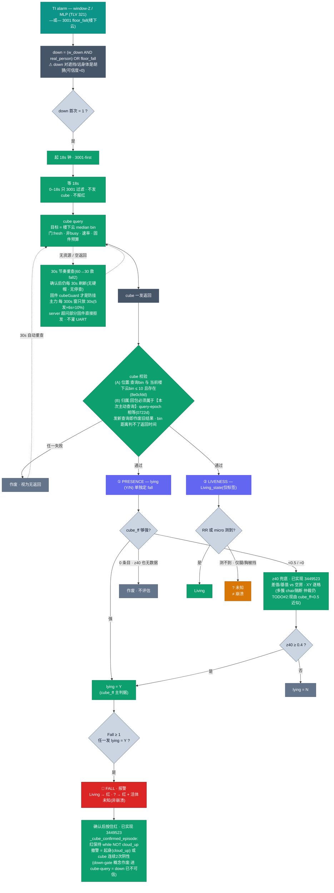

# Cube 跌倒判读流程

AWRL6844 fall pipeline。**cube 是唯一权威**;3001 只负责过滤与起 18s 钟,判决走 cube 的两维返回,trigger 无权在原地否决。

色标:🟢 已实现 · 🟠 TODO(设计定案,未实现) · 🔴 报警 · ⬛ 作废

> 交互版(深/浅色自适应):[`cube_fall_flow.html`](cube_fall_flow.html)

## 硬约束

- **18s** 3001-first:前 18s 只过滤,无 cube、不报红。
- 固件 cubeGuard 硬窗口 `300s`(3000 帧 @10fps)。
- 预算 `300` cube-帧/窗口(30s)= **10% 占空**;单发上限 `300` 帧(30s);server 用 60 帧/发。

## 判决原则

- **Fall ≥ 1**:任一发 `lying=Y` 即报。
- presence 主判据 = **cube_ff**(≥0.5),z40 兜底(cube_ff <0.5/=0/多簇 时)。
- `lying(Y/N)` 单独定 fall;`Living_state(Living/?)` 只贴标签。
- **"?" = 仅腿/遮挡测不到,≠ 崩溃。**
- **cube 是权威**:进 cube-query = down 已不可信 → down 不再排/撤 cube;确认后按住红,起身(cloud_up)或 cube 连 2 阴性 才撤。

## 阈值(已定案,用 case/ 标注数据标定)

- **cube_ff = `0.5`**:≥0.5 用 cube_ff 判 lying;<0.5 转 z40。(躺好信号 0.55-0.92 vs 远/静止 0.00,双峰空档)
- **z40 = `0.4`(现有,不动)**:down 已成立,只判躺(~28)vs 空(~0);站/走上游点云 Z 已排,不用抬。
- **重试节奏 = `30s`(60→30 救 fall2)**:60s 网格把落在前一次冷却影里的第二次跌倒饿死;防挂靠固件 cubeGuard(10% 占空硬闸,超预算固件拒发),server 节奏只摊预算。无 cubeGuard 固件则 ≥20s。
- **cube 校验 = (A)位置 `10 bin`(1bin≈10.8cm → ~1m)+ (B)归属 `query-epoch`**:发起查询即 +1,回包打戳,判决只认 `epoch == 当前` → 发新查询立刻作废旧包(fall1 的 cube 永远确认不了 fall2,bin 距离判不了返回时间)。
- ⚠️ cube 波束宽 → 分不了姿态/家具;姿态=点云 Z,排家具=z40+一次性空房基线。

## 状态

| 已实现(commit) | 内容 |
|---|---|
| c1110ac / b1f1adf / 8982ea6 / 7fb173c | 基线:cube 目标=楼下云 median · z40 dr+XY逐格+堵红漏 · 删 far-force · 确认后锁红 |
| 3449523 | cube_ff 主 / z40 兜底(纠正 A+B z40-primary 弄反) |
| eaafa5f | 重试刷新去停查自锁(确认后仍刷新) |
| 8e0cfdd | cube 校验 (A)位置 10 bin |
| 0722d | (B)归属改 **query-epoch** 时序绑定(替换 resp_bin ±10):只认本次主动查询回包 |
| 52e1f21 | 重试节奏 60→30s(救 fall2 时序饥饿;固件 cubeGuard 防挂) |

| TODO(未实现) | 内容 |
|---|---|
| #1 | down-gate:只认 down 为真时抓到的 cube(TODO1 3001 veto 重设计的时序补) |
| #2 | 真·多簇 per-cluster cube 分裂仲裁(现由 cube_ff<0.5 近似) |
| — | RANGE_STEP 校正(0.085 vs 实测 10.8cm/bin) |
